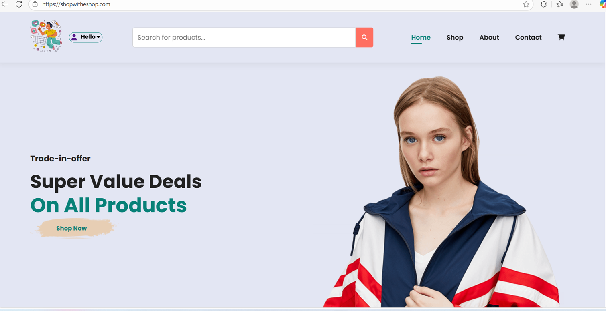
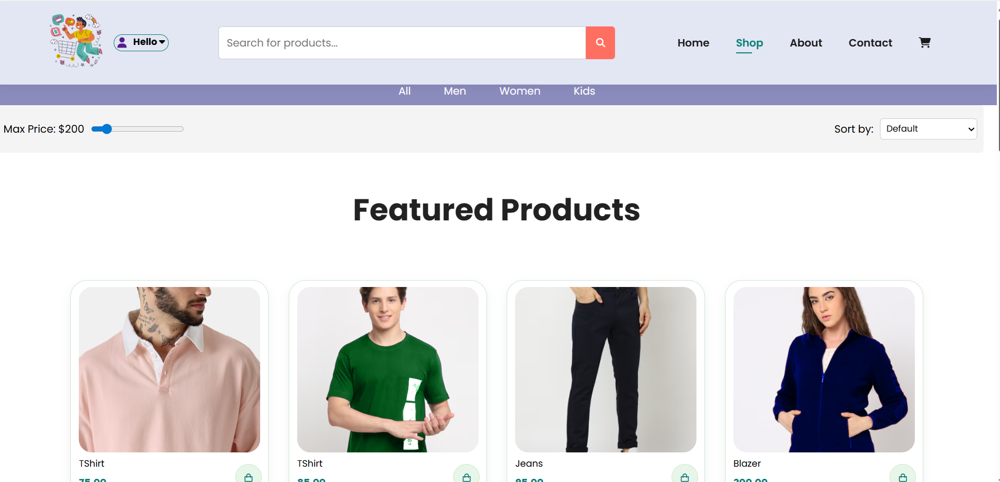
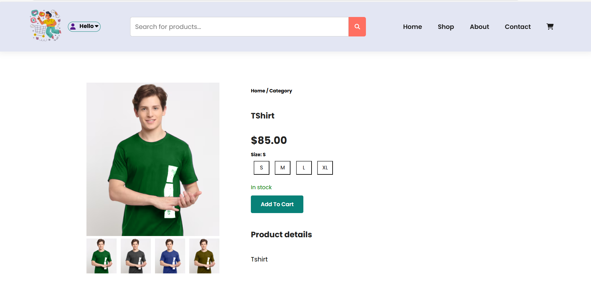
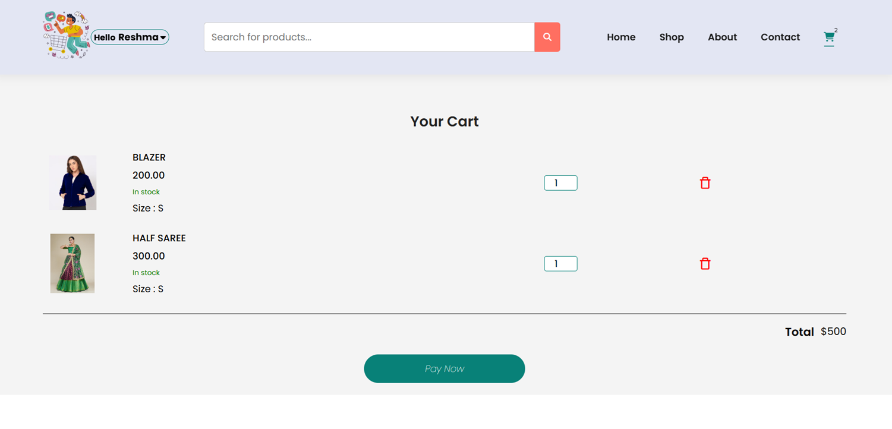
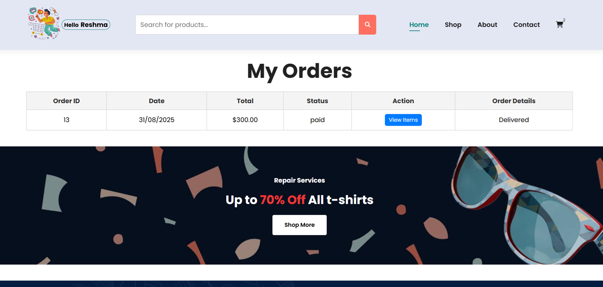
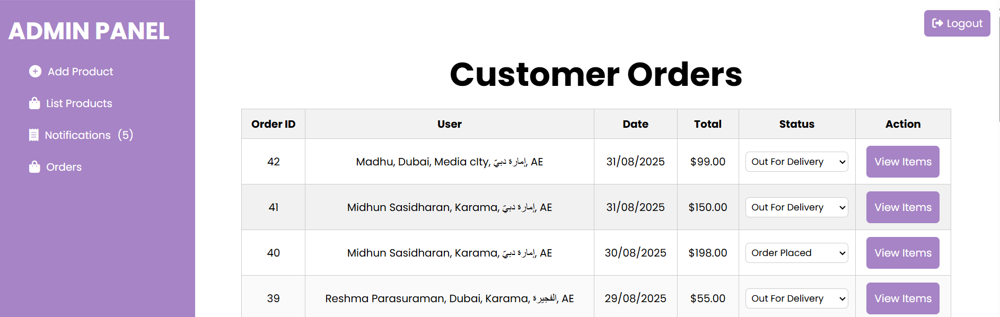

# 🛒 E-Commerce Website  

A scalable backend API for an e-commerce platform built with **Node.js**, **Express.js**, and **MySQL**, featuring secure **Stripe payment integration** and deployed on **AWS EC2 with Nginx**.

## 📌 Features  
- RESTful API for products, categories, users, and orders
- SQL JOINs for dynamic product-category relationships
- Stripe integration for secure payments
- Admin panel endpoints for product and order management
- Image hosting via Cloudinary (or local storage)
- Deployed on AWS EC2 with Nginx reverse proxy

## 🛠️ Tech Stack  

| Layer        | Technology         |
|--------------|--------------------|
| Backend      | Node.js, Express.js |
| Database     | MySQL              |
| Payment      | Stripe             |
| Deployment   | AWS EC2, Nginx     |


## 📦 Installation and Set up
```bash
1. Clone the repository:
git clone https://github.com/ReshmaMidhun/EShop.git
cd your-repo-name

2.Install backend dependencies:
npm install

3. Set up the database:
Update db.js with your DB credentials.

4. Create a .env file with your credentials:
# Database Configuration
DB_HOST=localhost
DB_USER=root
DB_PASS=yourpassword
DB_DATABASE =yourdatabase

# Stripe Payment
STRIPE_SECRET_KEY=sk_test_XXXXXXXXXXXXXXXX

# Application URL
DOMAIN=https://shopwitheshop.com      # or http://localhost:3000 for local

# Session Secret
SESSION_SECRET=8f9d7e5b1c2a3f4d6e7b8c9d0a1b2c3d


5.Start the server:
node server.js

6.Open index.html in your browser to view the site.

7.📸 Screenshots

 


 


8. 🌐 Live Demo
[View Live Project](https://shopwitheshop.com)

9.🙌 Contributing
Contributions are welcome! Please fork the repo and submit a pull request.

10. 🛠️ Deployment Notes
Hosted on AWS EC2 with Nginx configured for reverse proxy
PM2 used for process management
SSL via Let's Encrypt (optional)
